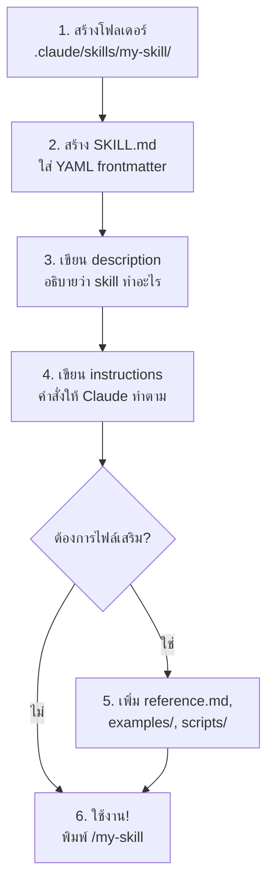

# 📚 วิธีสร้าง Agent Skill ใน Claude Code

> [!NOTE]
> สรุปจาก [Claude Code Official Docs](https://code.claude.com/docs/en/skills)

## 1. Skill คืออะไร?

Skill คือ **reusable prompt** ที่สามารถเรียกใช้ได้ 2 แบบ:
- **User เรียกเอง** — พิมพ์ `/skill-name` เป็น slash command
- **Claude เรียกอัตโนมัติ** — เมื่อ task ตรงกับ `description` ที่ระบุไว้ใน frontmatter

---

## 2. โครงสร้างไฟล์

```text
.claude/skills/<skill-name>/
├── SKILL.md           # (จำเป็น) ไฟล์หลักที่มี frontmatter + คำสั่ง
├── reference.md       # (optional) API docs รายละเอียดเพิ่มเติม
├── examples.md        # (optional) ตัวอย่างการใช้งาน
├── template.md        # (optional) template ให้ Claude fill in
└── scripts/
    └── helper.py      # (optional) script ที่ Claude execute ได้
```

> [!IMPORTANT]
> **`SKILL.md` คือไฟล์เดียวที่จำเป็นต้องมี** ไฟล์อื่นๆ เป็น optional ทั้งหมด

---

## 3. รูปแบบ SKILL.md

### YAML Frontmatter

```yaml
---
name: my-skill                    # ชื่อที่แสดง
description: >                    # (แนะนำ) อธิบายว่า skill ทำอะไร + เมื่อไหร่ควรใช้
  Summarizes uncommitted changes and flags anything risky.
  Use when the user asks what changed, wants a commit message,
  or asks to review their diff.
when_to_use: >                    # (optional) context เพิ่มเติมสำหรับ invocation
  When reviewing code changes before commit
disable-model-invocation: true    # (optional) ห้าม Claude เรียกเอง, user เท่านั้น
user-invocable: false             # (optional) ซ่อนจาก user menu, ให้ Claude เรียกเท่านั้น
allowed-tools: Read Grep          # (optional) จำกัด tools ที่ skill ใช้ได้
---
```

| Field | จำเป็น? | คำอธิบาย |
|---|---|---|
| `name` | ❌ | ชื่อที่แสดงให้เห็น |
| `description` | ✅ แนะนำ | อธิบาย skill + เมื่อไหร่ Claude ควรเรียกใช้ |
| `when_to_use` | ❌ | เงื่อนไขเพิ่มเติมสำหรับ auto-invocation |
| `disable-model-invocation` | ❌ | `true` = เฉพาะ user เรียกได้เท่านั้น |
| `user-invocable` | ❌ | `false` = ซ่อนจาก user, Claude เรียกเองได้ |
| `allowed-tools` | ❌ | จำกัดว่า skill ใช้ tools อะไรได้บ้าง |

### Markdown Content (คำสั่งให้ Claude)

หลัง frontmatter คือ **instructions** ที่ Claude จะทำตาม:

```markdown
---
description: Summarizes uncommitted changes and flags anything risky.
  Use when the user asks what changed, wants a commit message,
  or asks to review their diff.
---

## Current changes

!`git diff HEAD`

## Instructions

Summarize the changes above in two or three bullet points,
then list any risks you notice such as missing error handling,
hardcoded values, or tests that need updating.
If the diff is empty, say there are no uncommitted changes.
```

> [!TIP]
> **Dynamic Context Injection** — ใช้ `!`\`command\`` เพื่อ inject output ของ command เข้าไปใน prompt ตอน runtime เช่น `!`\`git diff HEAD\``

---

## 4. การอ้างอิงไฟล์เสริม

ภายใน `SKILL.md` สามารถ link ไปยังไฟล์เสริมได้:

```markdown
## Additional resources

- For complete API details, see [reference.md](reference.md)
- For usage examples, see [examples.md](examples.md)
```

Claude จะโหลดไฟล์เหล่านี้เมื่อจำเป็นเท่านั้น (lazy loading)

---

## 5. ตำแหน่งที่วาง Skill

| ตำแหน่ง | Scope |
|---|---|
| `.claude/skills/<name>/` | **Project-level** — ใช้ได้กับ repo นี้ |
| `~/.claude/skills/<name>/` | **Global** — ใช้ได้ทุก project |
| Plugin `skills/` directory | **Plugin-scoped** — แชร์ผ่าน plugin |

---

## 6. ตัวอย่างสร้าง Skill ง่ายๆ

### ตัวอย่าง: `/standup` Skill

```text
.claude/skills/standup/
└── SKILL.md
```

**SKILL.md:**
```markdown
---
name: standup
description: Summarizes what I worked on today from git log. Use when the user asks for a standup summary.
---

## Today's git activity

!`git log --oneline --since="midnight" --author="$(git config user.name)"`

## Instructions

Summarize the commits above into 2-3 bullet points suitable for a
daily standup meeting. Group related changes together.
If there are no commits, say "No commits yet today."
```

### ตัวอย่าง: `/review-diff` Skill

**SKILL.md:**
```markdown
---
name: review-diff
description: Reviews staged changes for potential issues before committing.
allowed-tools: Read Grep
---

## Staged changes

!`git diff --cached`

## Instructions

Review the staged changes above. Check for:
1. Missing error handling
2. Hardcoded values that should be config
3. Tests that may need updating
4. Security concerns

Provide actionable feedback in bullet points.
```

---

## 7. Skill ภายใน Plugin

ถ้าต้องการแชร์ skill เป็น plugin:

```text
my-plugin/
├── .claude-plugin/
│   └── plugin.json
├── skills/
│   ├── code-reviewer/
│   │   └── SKILL.md
│   └── pdf-processor/
│       ├── SKILL.md
│       └── scripts/
│           └── process.py
├── commands/               # Skills แบบ flat .md files
│   ├── status.md
│   └── logs.md
└── agents/                 # Subagent definitions
    └── security-reviewer.md
```

เรียกใช้ skill จาก plugin ด้วย namespace: `/plugin-name:skill-name`

```bash
# สร้าง plugin ด้วย CLI
claude plugin init my-helper --with skills hooks
```

---

## 8. สรุปขั้นตอนสร้าง Skill



> [!TIP]
> **วิธีง่ายสุด:** บอก Claude ตรงๆ ว่า _"make me a /standup skill that summarizes what I worked on today from git log"_ แล้ว Claude จะสร้างให้เอง!
