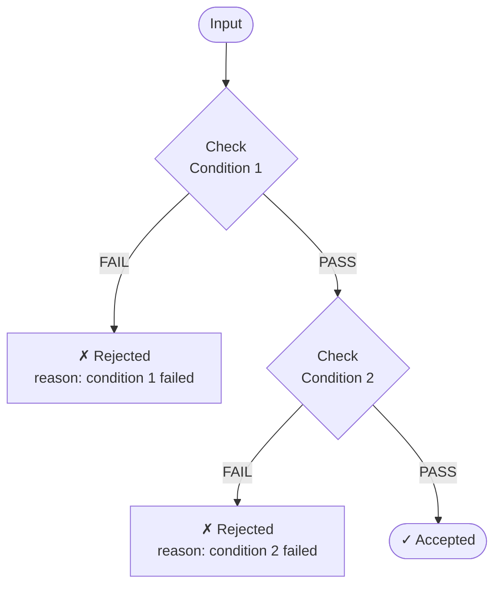

# Combination Method: Sequential (Short-Circuit)

Follow the business validation order. If an earlier condition fails, stop — don't test later conditions for that scenario.

## Flowchart Diagram

Show a flowchart before the table. Output **both ASCII and Mermaid** formats. See [references/mermaid.md](mermaid.md) for full format rules and examples.

ASCII:
```
Sequential Validation: {Condition1} → {Condition2} → ...

                ┌──────────┐
                │  Input   │
                └────┬─────┘
                     │
                ┌────▼─────┐
                │  Check   │──FAIL──► ✗ Rejected
                │ {Cond1}  │          ({reason})
                └────┬─────┘
                   PASS
                     │
                ┌────▼─────┐
                │  Check   │──FAIL──► ✗ Rejected
                │ {Cond2}  │          ({reason})
                └────┬─────┘
                   PASS
                     │
                ┌────▼─────┐
                │ Accepted │
                └──────────┘
```

Mermaid:


## Rules
- For each invalid value of condition 1: ONE scenario (fails at step 1, **all other fields use their NOMINAL value — never use invalid values for conditions after the failure point**)
- For valid condition 1 × invalid condition 2: ONE scenario per invalid value (passes step 1, fails at step 2, **all remaining conditions use nominal**)
- Continue until all conditions pass (happy path)
- Add "Fails At" column to show which step rejected
- Follow the **Test Scenarios Table Format** in [references/common.md](common.md): business-readable column headers, condition sub-columns split into select value + parameter, Business Scenario narrative, and Covers traceability column
- Label: **"Test Scenarios (sequential — for acceptance/integration testing)"**

**Example (File Type → File Size):** For "invalid file type" scenarios, always use the nominal file size (e.g. 50 MB). Do NOT also use an invalid size — only one field fails per scenario.

## Validation Order

Present **exactly 2-3 possible validation orders** as text suggestions **before generating the table**:
- Show each option on its own line with a label
- Put recommended order first with "(Recommended)" label
- Explain why each order makes business sense (1 sentence per option)
- Then proceed immediately with the **recommended order** to generate the scenarios table
- Add a note: "If you prefer a different order, let me know and I'll regenerate."

**Always show at least 2 options. Never show just one.**

Examples:
```
Suggested validation orders:
1. Age → Income → Credit Score (Recommended) — cheapest eligibility check first, then financial capacity, then creditworthiness
2. Credit Score → Income → Age — filter high-risk applicants first before checking other criteria
3. Income → Age → Credit Score — financial capacity is the primary business concern
```

If `AskUserQuestion` is available, use it to ask for order confirmation instead of proceeding automatically.
