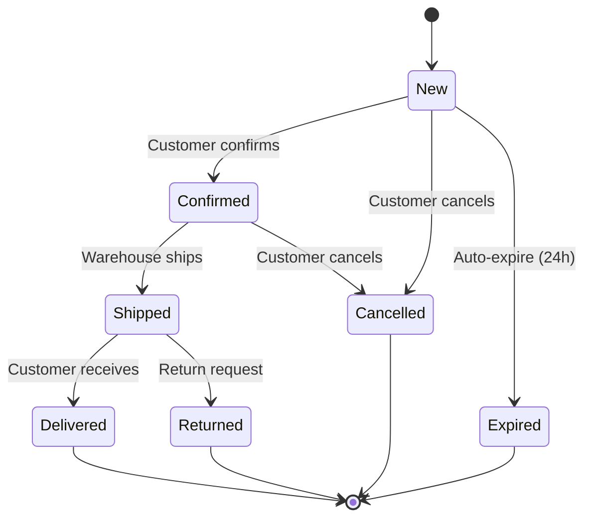
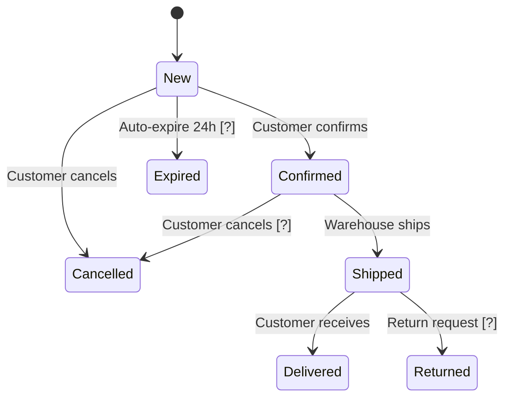
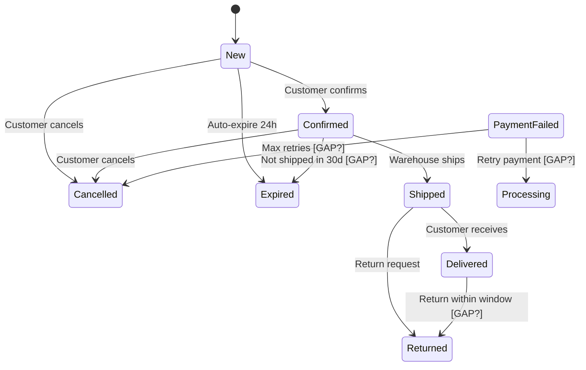
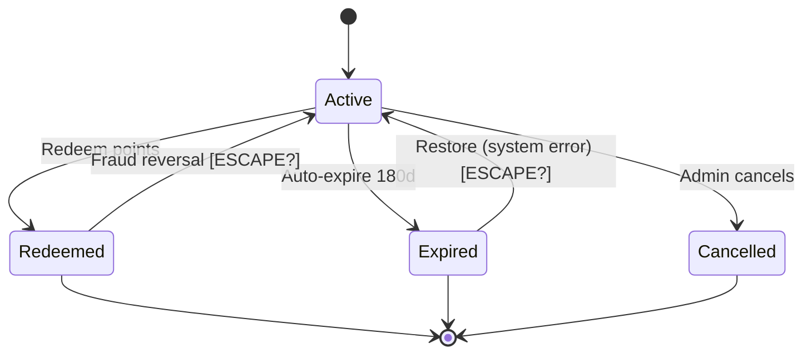
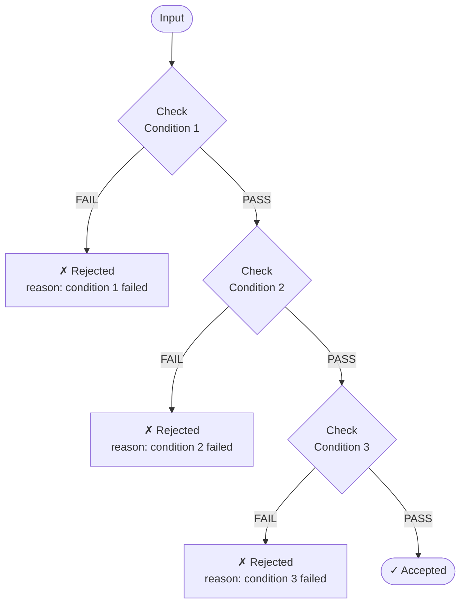
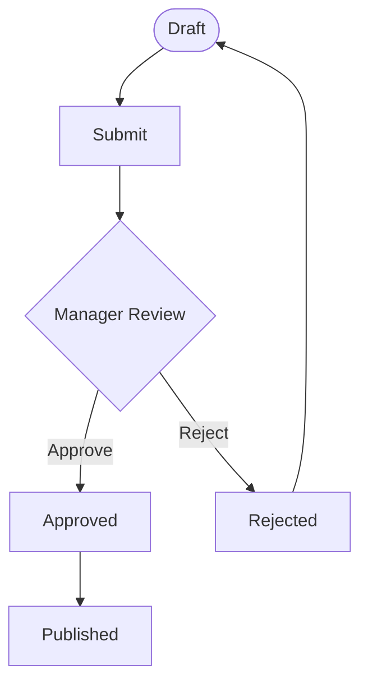

# Mermaid Diagram Generation

When generating diagrams, **always output both formats** — ASCII and Mermaid — side by side. This ensures non-Mermaid users (plain text, terminals, some editors) can still read the diagram while Mermaid-capable viewers (GitHub, VS Code, Obsidian, etc.) render it visually.

**Output order for every diagram:**
1. ASCII diagram first (in a plain ` ``` ` code block)
2. Mermaid diagram immediately after (in a `mermaid` fenced code block)

## Diagram Type Mapping

| Diagram | ASCII | Mermaid type |
|---|---|---|
| State transition diagram (STT) | Yes | `stateDiagram-v2` |
| Sequential validation flowchart | Yes | `flowchart TD` |
| Number line (BVA) | Yes — ASCII only | No Mermaid equivalent |
| EP partition / Venn overlap | Yes — ASCII only | No Mermaid equivalent |
| Combined EP partition diagram | Yes — ASCII only | No Mermaid equivalent |

---

## State Transition Diagrams (`stateDiagram-v2`)

### Final diagram (all confirmed transitions)

ASCII:
```
Order Management

  [Start] ──► [New] ──customer confirms──► [Confirmed] ──warehouse ships──► [Shipped] ──customer receives──► [Delivered] ──► [End]
                │                               │                                 │
                │ customer cancels              │ customer cancels                │ return request
                ▼                               ▼                                 ▼
           [Cancelled] ──► [End]          [Cancelled]                        [Returned] ──► [End]
                │
                │ auto-expire (24h)
                ▼
           [Expired] ──► [End]
```

Mermaid:


### Proposal diagram — Phase 1 (with `[?]` suggestions)

Requirement transitions have no tag. Domain knowledge suggestions are labeled `[?]`.

ASCII:
```
Solid arrows (──►) = requirement    [?] = domain knowledge suggestion

  [New] ──customer confirms──► [Confirmed] ──warehouse ships──► [Shipped] ──customer receives──► [Delivered]
    │                               │                                 │
    │ customer cancels         customer cancels [?]             return request [?]
    ▼                               ▼                                 ▼
[Cancelled]                    [Cancelled]                       [Returned]
    ▲
    │ auto-expire 24h [?]
  (from New)
    ▼
[Expired]
```

Mermaid:


```
[?] = domain knowledge suggestion — confirm whether to include
```

### Gap check diagram — Phase 2 (with `[GAP?]` entries)

Confirmed transitions shown normally. Plausible-but-unconfirmed transitions labeled `[GAP?]`.

ASCII:
```
Confirmed (──►)    [GAP?] = common in this domain but not yet confirmed

  [New] ──► [Confirmed] ──► [Shipped] ──► [Delivered]
    │            │               │               │
    cancel       cancel       return         return within window [GAP?]
    ▼            ▼           request              ▼
[Cancelled]  [Cancelled]  [Returned]        [Returned]
    │
    auto-expire 24h
    ▼
[Expired] ◄──── not shipped in 30d [GAP?] ──── [Confirmed]
[Payment Failed] ──retry [GAP?]──► [Processing]
[Payment Failed] ──max retries [GAP?]──► [Cancelled]
```

Mermaid:


```
[GAP?] = common in this domain but not confirmed in scope — include or exclude?
```

### Quasi-terminal resurrection paths (Step 3b)

ASCII:
```
Solid (──►) = confirmed    [ESCAPE?] = quasi-terminal escape path pending confirmation

  [Active] ──redeem──► [Redeemed] ──► [End]
      │                    │
      │ auto-expire 180d   │ fraud reversal [ESCAPE?]
      ▼                    ▼
  [Expired] ──► [End]   [Active]
      │
      │ restore system error [ESCAPE?]
      ▼
  [Active]
```

Mermaid:


```
[ESCAPE?] = quasi-terminal — confirm whether this resurrection path is in scope
```

---

## Sequential Validation Flowcharts (`flowchart TD`)

Always output both ASCII and Mermaid for sequential flowcharts.

ASCII:
```
Sequential Validation: {Condition1} → {Condition2} → {Condition3}

                ┌──────────┐
                │  Input   │
                └────┬─────┘
                     │
                ┌────▼──────────┐
                │ Check         │──FAIL──► ✗ Rejected (condition 1 reason)
                │ {Condition 1} │
                └────┬──────────┘
                   PASS
                     │
                ┌────▼──────────┐
                │ Check         │──FAIL──► ✗ Rejected (condition 2 reason)
                │ {Condition 2} │
                └────┬──────────┘
                   PASS
                     │
                ┌────▼──────────┐
                │ Check         │──FAIL──► ✗ Rejected (condition 3 reason)
                │ {Condition 3} │
                └────┬──────────┘
                   PASS
                     │
                ┌────▼─────┐
                │ Accepted │
                └──────────┘
```

Mermaid:


For branching outcomes (Approve / Reject):

ASCII:
```
  [Draft] ──► [Submitted] ──► [Review] ──┬── Approve ──► [Approved] ──► [Published]
                                          └── Reject  ──► [Rejected] ──► [Draft] (cycle)
```

Mermaid:


---

## General Rules

- Always output **both** ASCII (plain ` ``` ` block) and Mermaid (`mermaid` block) for every supported diagram
- ASCII first, Mermaid immediately after — no other content between them
- Always use `mermaid` as the fenced code block language tag
- Keep node labels short — max 3–4 words per node
- Use `[*]` for initial and terminal states in `stateDiagram-v2`
- Use `([text])` for start/end rounded nodes in `flowchart TD`
- Use `{text}` for decision diamonds in `flowchart TD`
- Use `[text]` for regular process boxes in `flowchart TD`
- Add a plain-text legend after both diagram blocks when `[?]`, `[GAP?]`, or `[ESCAPE?]` labels are present
